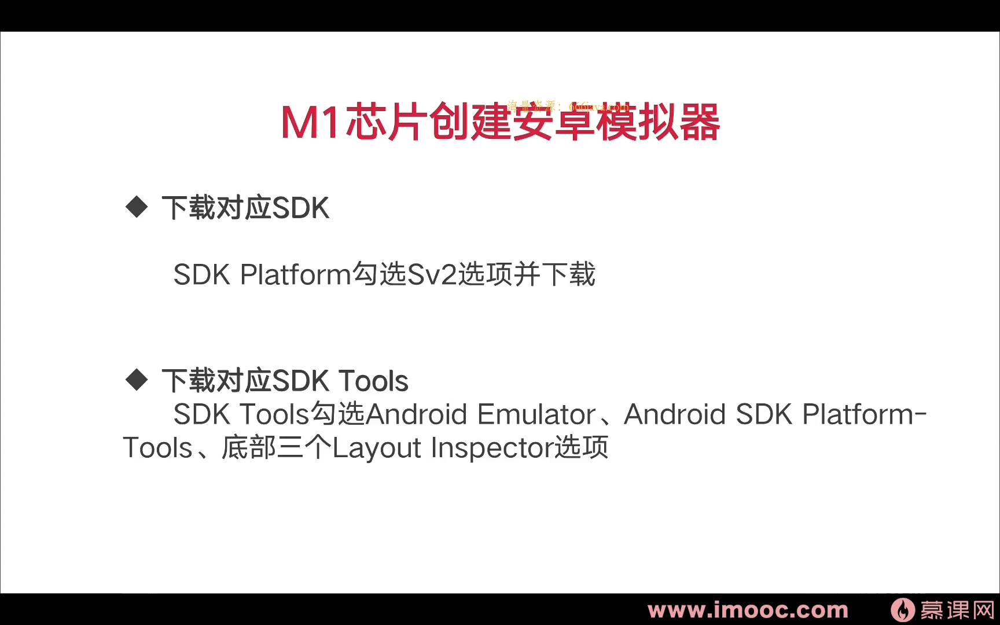

# 3-7 AndroidStudio创建模拟器，及m1芯片创建方法

|本期版本|上期版本
|:---:|:---:
`Mon Mar 27 14:47:16 CST 2023` |


### emulator image

* <https://dl.google.com/android/repository/sys-img/google_apis/x86_64-33_r09.zip>


```bash
unzip x86_64-33_r09.zip
mv x86_64 $ANDROID_HOME/system-images/android-33/google_apis
``` 


